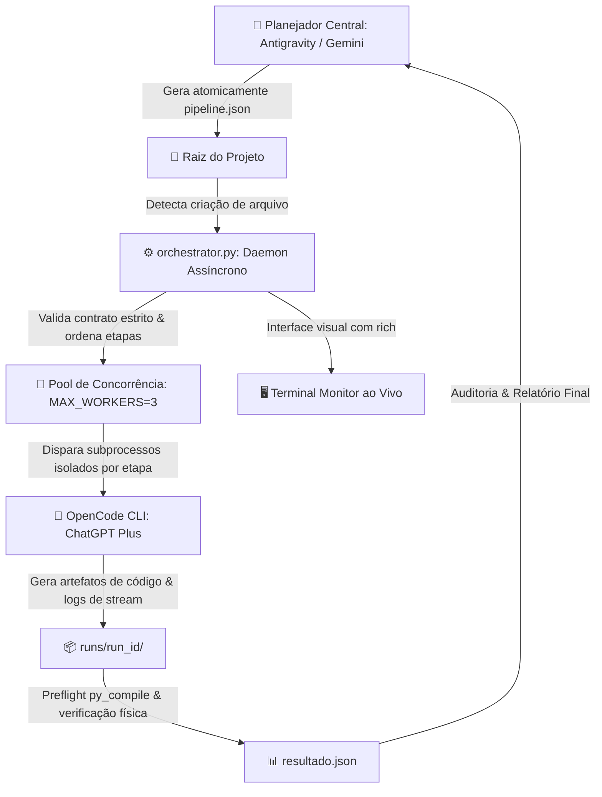

# 🚀 Esteira Multiagente Local: Antigravity + OpenCode CLI + Daemon Python

Este projeto implementa uma **arquitetura multiagente local e determinística**, desacoplando a camada de alto nível (**Planejador & Orquestrador Central no Antigravity / Gemini**) da camada de execução física de código (**OpenCode CLI autenticado no ChatGPT Plus**) através de um motor de fila assíncrono em Python (**`orchestrator.py`**).

> **Autoria & Validação Cruzada:**  
> - **Escritor da Documentação:** Gemini (Antigravity)  
> - **Revisor Técnico (Peer Review):** GPT (via OpenCode CLI)

---

## 🏗️ 1. Arquitetura do Sistema



### Divisão de Responsabilidades:
1. **Planejador Central (Antigravity / Gemini):** Lê contextos complexos, planeja soluções, decompõe problemas em etapas atômicas (`ordem: 1, 2, ...`), submete manifestos em JSON e audita os artefatos gerados.
2. **Motor de Execução Local (`orchestrator.py`):** Daemon assíncrono em Python com suporte a concorrência (`asyncio.gather`), semáforos configuráveis, preflight de sintaxe (`python3 -m py_compile`), timeout por tarefa e painel visual em terminal via `rich`.
3. **Executor Local (OpenCode CLI):** Agente de execução que roda isolado em `runs/<run_id>/`, acessando os modelos de ponta da OpenAI (família GPT-5) via ChatGPT Plus OAuth para aplicar patches e gerar código.

---

## 📋 2. Pré-requisitos para Replicação

Para replicar este projeto em outro computador, você precisará de:

- **Sistema Operacional:** Linux (testado e homologado no Linux Mint / Ubuntu / Debian) ou macOS.
- **Python:** Versão 3.10 ou superior (`python3 --version`).
- **OpenCode CLI:** Ferramenta de linha de comando oficial da [OpenCode](https://opencode.ai).
- **Conta OpenAI:** Assinatura ativa do **ChatGPT Plus** (ou Team/Enterprise) para autenticação OAuth via navegador.

---

## 🛠️ 3. Passo a Passo de Configuração em uma Nova Máquina

### Passo 1: Clonar ou Baixar os Arquivos do Projeto
```bash
git clone <url-do-repositorio> "Agentes de IA"
cd "Agentes de IA"
```

### Passo 2: Instalar as Dependências Python
Instale a biblioteca `rich` para o monitor visual no terminal:
```bash
pip install -r requirements.txt
```

### Passo 3: Instalar o OpenCode CLI
Execute o comando oficial de instalação:
```bash
curl -fsSL https://opencode.ai/install | bash
```
> *Nota: Certifique-se de que `~/.opencode/bin` está presente no seu `PATH` (adicione ao seu `~/.bashrc` se necessário).*

### Passo 4: Autenticar o OpenCode no ChatGPT Plus
Vincule sua conta ChatGPT via OAuth no navegador:
```bash
opencode providers login
```
Escolha a opção **OpenAI** e complete a autorização no navegador.

### Passo 5: Verificação do Ambiente
Confirme que todas as ferramentas estão prontas para uso:
```bash
python3 --version
which opencode
opencode auth list
opencode models
```

---

## 💻 4. Como Operar o Sistema

### 1. Iniciar o Monitor Visual no Terminal
Abra uma janela de terminal e inicie o orquestrador usando o script facilitador com auto-restart:
```bash
./start_monitor.sh
```
Ou diretamente via Python:
```bash
python3 orchestrator.py
```

Você verá o painel estilizado com status **ONLINE** aguardando manifestos:
```text
╭────────────────────────── 🚀 ORQUESTRADOR MULTIAGENTE LOCAL ──────────────────────────╮
│ Status: ONLINE - Monitorando pipeline.json                                            │
│ Workers Concorrentes: 3                                                               │
│ Runner Ativo: OpenCode CLI (ChatGPT Plus OAuth)                                       │
│ Diretório Base: /home/usuario/Projetos/Agentes de IA                                  │
╰──────────────────────────────────────────────────────────────────────────────────────╯
```

### 2. Submissão de Tarefas (`pipeline.json`)
O orquestrador vigia a presença do arquivo `pipeline.json` na raiz. 

> **Regra Obrigatória:** Sempre escreva primeiro como `pipeline.json.tmp` e em seguida renomeie atomicamente para `pipeline.json` (`mv pipeline.json.tmp pipeline.json`).

#### Contrato Estrito de 7 Campos por Tarefa:
```json
[
  {
    "id": "tarefa_01",
    "ordem": 1,
    "runner": "opencode",
    "modelo": "openai/gpt-5.4-mini",
    "timeout": 120,
    "prompt": "Instrução clara, autossuficiente e direta de código...",
    "arquivo_saida": "modulo.py"
  }
]
```

| Campo | Tipo | Descrição |
| :--- | :--- | :--- |
| `id` | `str` | Identificador alfanumérico único da tarefa. |
| `ordem` | `int` | Inteiro positivo sequencial (1, 2, 3...). Tarefas da mesma ordem rodam em **paralelo**. A ordem $N+1$ só inicia se todas da ordem $N$ concluírem com sucesso. |
| `runner` | `str` | Fixo em `"opencode"`. |
| `modelo` | `str` | Identificador suportado localmente (ex.: `"openai/gpt-5.4-mini"`, `"openai/gpt-5.5"`, `"openai/gpt-5.6-luna"`). |
| `timeout` | `int` | Tempo máximo em segundos para a tarefa (ex.: `120`). |
| `prompt` | `str` | Instrução de código completa e autocontida para o modelo. |
| `arquivo_saida`| `str` | Caminho relativo do artefato esperado dentro da pasta da run. |

---

## 📂 5. Estrutura de Diretórios e Ciclo de Execução

```text
Agentes de IA/
├── orchestrator.py          # Motor assíncrono de orquestração local
├── start_monitor.sh         # Script facilitador de inicialização do terminal
├── requirements.txt         # Dependências mínimas do orquestrador (rich)
├── .gitignore               # Proteção contra commit de credenciais e logs
├── README.md                # Esta documentação completa
├── orchestrator.log         # Log consolidado histórico de execuções
├── pipeline.json.done       # Último manifesto processado com sucesso
└── runs/                    # Diretório isolado contendo histórico de runs
    └── run_20260907_165207_d488/
        ├── pipeline.json    # Cópia imutável do manifesto executado
        ├── resultado.json   # Sumário estrito de status e tempos da rodada
        ├── log_tarefa_01.log# Logs de stream (STDOUT e STDERR) da tarefa
        └── modulo.py        # Código gerado e validado por preflight
```

---

## 🔍 6. Auditoria de Qualidade e Preflight

O `orchestrator.py` possui proteções integradas de qualidade:
1. **Preflight de Sintaxe:** Antes de marcar uma tarefa Python (`.py`) como `SUCESSO`, executa `python3 -m py_compile <arquivo>`. Se houver qualquer erro de indentação ou sintaxe, a tarefa é imediatamente marcada como `FALHA` com o traceback registrado no `resultado.json`.
2. **Validação Física:** Garante que o arquivo existe e seu tamanho é superior a 0 bytes.
3. **Isolamento de Runs:** Cada execução ocorre em uma subpasta dedicada com UUID e timestamp, evitando colisão de artefatos.

---

## 🚨 7. Resolução de Problemas (Troubleshooting)

| Sintoma | Causa Provável | Solução Recomendada |
| :--- | :--- | :--- |
| `opencode: command not found` | Binário não adicionado ao `PATH` | Execute `export PATH="$HOME/.opencode/bin:$PATH"` ou adicione ao `~/.bashrc`. |
| `OpenCode auth error / Bad Request` | Modelo incompatível com OAuth do ChatGPT | Use os modelos homologados: `openai/gpt-5.4-mini`, `openai/gpt-5.5` ou `openai/gpt-5.6-luna`. |
| `Falha de validação do manifesto` | Campos ausentes ou tipos inválidos | Verifique se os 7 campos exatos estão presentes e se `ordem` é um inteiro positivo. |
| `Timeout excedido` | Tarefa complexa exigiu mais tempo de resposta | Aumente o campo `"timeout"` no `pipeline.json` (ex.: de `120` para `180`). |
| `Terminal fecha ao encerrar` | Execução direta sem loop | Utilize o `./start_monitor.sh`, que possui loop com auto-restart integrado. |

---

## 🧪 8. Testes Validados com Sucesso na Esteira

1. **Smoke Test:** Validação de comunicação, escrita e leitura de integridade de arquivo no disco (`smoke_test.py`).
2. **Paralelismo Real (3 Workers):** Geração concorrente dos módulos `extractor.py`, `transformer.py` e `reporter.py` com ganho de velocidade superior a 2.4x.
3. **Pipeline Sequencial de 2 Etapas:** Integração dos 3 módulos gerados na Etapa 1 através de um script integrador `main.py` na Etapa 2.
4. **Inspeção de Sistema Operacional Real:** Diagnóstico do ambiente visual de temas do Linux Mint Cinnamon via `gsettings`.
5. **Multi-Modelos Concorrentes:** 3 agentes rodando simultaneamente em 3 modelos GPT distintos (`GPT-5.4-Mini`, `GPT-5.5` e `GPT-5.6-Luna`).
6. **Peer Review de Documentação:** Análise crítica automatizada da documentação realizada pelo GPT com emissão de parecer formal em Markdown.
